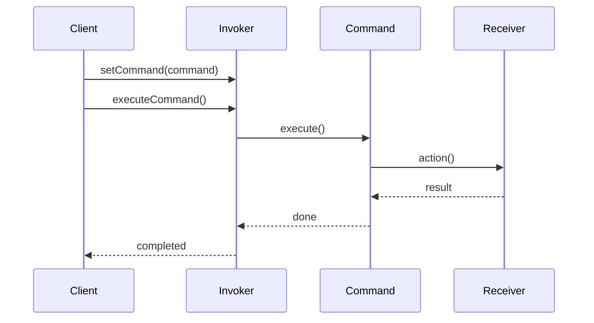

# Command Pattern

## What is the Pattern?

The Command pattern encapsulates a request as an object, allowing you to parameterize clients with different requests, queue operations, and support undoable operations. It decouples the requester from the receiver by introducing an intermediate command object.

## Key Participants

| Participant | Description |
|-------------|-------------|
| **Command** | Declares an interface for executing an operation |
| **ConcreteCommand** | Implements the execute method by invoking operations on the receiver |
| **Client** | Creates a ConcreteCommand and sets its receiver |
| **Invoker** | Asks the command to carry out the request |
| **Receiver** | Knows how to perform the operations associated with a command |

## Key Characteristics

- **Encapsulation**: Requests are encapsulated as objects
- **Decoupling**: Separates request sender from request handler
- **Extensibility**: Easy to add new commands without changing existing code
- **Composability**: Commands can be composed into complex operations
- **Undo Support**: Can implement undo/redo functionality
- **Queue Support**: Commands can be queued and executed later

## How it Works

1. **Client** creates a **ConcreteCommand** and specifies its **Receiver**
2. **Invoker** stores the command and calls its `execute()` method
3. **ConcreteCommand** calls operations on the **Receiver** to carry out the request
4. The **Receiver** performs the actual work

## Structure

```
Client → Invoker → Command → Receiver
                ↓
            ConcreteCommand
```

## Benefits

✅ **Decouples sender from receiver** - Sender doesn't need to know about the receiver's interface  
✅ **Supports undo operations** - Commands can store state for reversal  
✅ **Supports queuing** - Commands can be queued and executed later  
✅ **Supports logging** - All operations can be logged for audit trails  
✅ **Supports macro commands** - Multiple commands can be combined  
✅ **Easy to extend** - New commands can be added without changing existing code  

## Drawbacks

❌ **Increased complexity** - Introduces additional classes and interfaces  
❌ **Memory overhead** - Each command creates an object  
❌ **Potential over-engineering** - May be unnecessary for simple operations  
❌ **Debugging complexity** - Stack traces become more complex  

## When to Use / Avoid

**Use when:**
- You need to parameterize objects with operations
- You want to queue operations, schedule their execution, or execute them remotely
- You need to support undo operations
- You want to structure a system around high-level operations built on primitive operations
- You need to support logging of operations

**Avoid when:**
- Operations are simple and don't need the flexibility of commands
- Performance is critical and object creation overhead is a concern
- The system is already complex and adding commands would make it harder to understand

## Real-World Examples

- **Text Editor Operations**: Copy, paste, cut, undo, redo
- **GUI Button Actions**: Each button click triggers a specific command
- **Database Transactions**: Each transaction is a command that can be committed or rolled back
- **Game Input Handling**: Player actions are commands that can be queued and processed
- **Remote Procedure Calls**: Commands can be serialized and sent over network

## Common Implementation Variations

### 1. Simple Command
```typescript
interface Command {
  execute(): void;
}

class SimpleCommand implements Command {
  constructor(private receiver: Receiver) {}
  
  execute(): void {
    this.receiver.action();
  }
}
```

### 2. Command with Parameters
```typescript
interface Command {
  execute(...args: any[]): void;
}

class ParameterizedCommand implements Command {
  constructor(
    private receiver: Receiver,
    private params: any[]
  ) {}
  
  execute(): void {
    this.receiver.action(...this.params);
  }
}
```

### 3. Undoable Command
```typescript
interface UndoableCommand extends Command {
  undo(): void;
}

class UndoableCommand implements UndoableCommand {
  private previousState: any;
  
  execute(): void {
    this.previousState = this.receiver.getState();
    this.receiver.action();
  }
  
  undo(): void {
    this.receiver.setState(this.previousState);
  }
}
```

### 4. Macro Command
```typescript
class MacroCommand implements Command {
  private commands: Command[] = [];
  
  add(command: Command): void {
    this.commands.push(command);
  }
  
  execute(): void {
    this.commands.forEach(cmd => cmd.execute());
  }
}
```

## Related Patterns

- **Chain of Responsibility**: Can be used to determine which command to execute
- **Memento**: Often used with Command to store state for undo operations
- **Strategy**: Commands can be seen as strategies for performing operations
- **Template Method**: Commands can use template methods for common execution patterns
- **Composite**: Macro commands can be implemented using the Composite pattern

## Implementation Highlights

- **Command Interface**: Defines the contract for all commands
- **Receiver Coupling**: Commands are tightly coupled to their receivers
- **Invoker Flexibility**: Invokers can work with any command that implements the interface
- **State Management**: Commands can store state for undo operations
- **Composition**: Commands can be composed into more complex operations

## Sequence Diagram



## Pitfalls & Anti-Patterns

- **Command Explosion**: Creating too many command classes for simple operations
- **Tight Coupling**: Commands that are too tightly coupled to specific receivers
- **State Pollution**: Storing too much state in commands
- **Over-Engineering**: Using commands when simple function calls would suffice

## Testing Tips

- Test each command in isolation
- Verify undo operations work correctly
- Test command composition and macro commands
- Ensure commands are properly serializable if needed
- Test error handling in command execution

## Performance Notes

- Command objects add memory overhead
- Consider object pooling for frequently used commands
- Macro commands can improve performance by batching operations
- Lazy command creation can reduce initial memory usage 