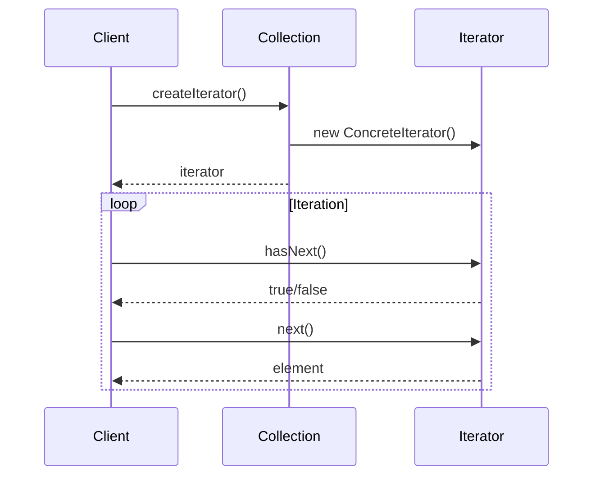

# Iterator Pattern

## What is the Pattern?

The Iterator pattern provides a way to access the elements of a collection sequentially without exposing its underlying representation. It decouples the collection from the traversal logic, allowing you to iterate over different types of collections using a uniform interface.

## Key Participants

| Participant | Description |
|-------------|-------------|
| **Iterator** | Defines an interface for accessing and traversing elements |
| **ConcreteIterator** | Implements the Iterator interface and keeps track of the current position |
| **Collection** | Defines an interface for creating an Iterator object |
| **ConcreteCollection** | Implements the Collection interface and returns an instance of ConcreteIterator |

## Key Characteristics

- **Encapsulation**: Hides the internal structure of the collection
- **Uniform Interface**: Provides consistent way to traverse different collections
- **Multiple Iterators**: Can have multiple iterators for the same collection
- **Lazy Evaluation**: Can implement lazy loading of elements
- **Bidirectional**: Can support forward and backward traversal
- **Thread-Safe**: Can be made thread-safe for concurrent access

## How it Works

1. **Collection** provides a method to create an **Iterator**
2. **Iterator** maintains the current position and provides methods to access elements
3. **Client** uses the **Iterator** to traverse the collection without knowing its structure
4. **Iterator** handles the traversal logic and state management

## Structure

```
Client → Collection → Iterator
                ↓
        ConcreteCollection → ConcreteIterator
```

## Benefits

✅ **Decouples collection from traversal** - Collection doesn't need to know about iteration logic  
✅ **Supports multiple traversal algorithms** - Different iterators for different purposes  
✅ **Simplifies collection interface** - Collection only needs to provide iterator creation  
✅ **Enables lazy evaluation** - Elements can be loaded on-demand  
✅ **Supports concurrent iteration** - Multiple iterators can work simultaneously  
✅ **Hides internal structure** - Client doesn't need to know collection implementation  

## Drawbacks

❌ **Increased complexity** - Introduces additional classes and interfaces  
❌ **Performance overhead** - Iterator objects add memory and method call overhead  
❌ **Limited random access** - Sequential access may not be optimal for all use cases  
❌ **State management** - Iterator state can become complex for advanced scenarios  

## When to Use / Avoid

**Use when:**
- You want to access a collection's contents without exposing its internal structure
- You want to support multiple traversal algorithms for the same collection
- You want to provide a uniform interface for traversing different collection types
- You need to implement lazy loading of collection elements
- You want to support concurrent iteration over the same collection

**Avoid when:**
- The collection is simple and doesn't need complex traversal logic
- Performance is critical and iterator overhead is unacceptable
- You need random access to collection elements
- The collection structure is unlikely to change

## Real-World Examples

- **Database Result Sets**: Iterating over query results without loading all data
- **File System Traversal**: Walking through directories and files
- **Tree Structures**: Traversing hierarchical data structures
- **Stream Processing**: Processing data streams with different algorithms
- **GUI Component Collections**: Iterating over UI elements for updates

## Common Implementation Variations

### 1. Basic Iterator
```typescript
interface Iterator<T> {
  hasNext(): boolean;
  next(): T;
  current(): T;
}

class ArrayIterator<T> implements Iterator<T> {
  private index: number = 0;
  
  constructor(private array: T[]) {}
  
  hasNext(): boolean {
    return this.index < this.array.length;
  }
  
  next(): T {
    return this.array[this.index++];
  }
  
  current(): T {
    return this.array[this.index];
  }
}
```

### 2. Bidirectional Iterator
```typescript
interface BidirectionalIterator<T> extends Iterator<T> {
  hasPrevious(): boolean;
  previous(): T;
  reset(): void;
}

class BidirectionalArrayIterator<T> implements BidirectionalIterator<T> {
  private index: number = 0;
  
  constructor(private array: T[]) {}
  
  hasNext(): boolean {
    return this.index < this.array.length;
  }
  
  next(): T {
    return this.array[this.index++];
  }
  
  hasPrevious(): boolean {
    return this.index > 0;
  }
  
  previous(): T {
    return this.array[--this.index];
  }
  
  reset(): void {
    this.index = 0;
  }
}
```

### 3. Filtering Iterator
```typescript
class FilteringIterator<T> implements Iterator<T> {
  private iterator: Iterator<T>;
  private predicate: (item: T) => boolean;
  private current: T | null = null;
  
  constructor(iterator: Iterator<T>, predicate: (item: T) => boolean) {
    this.iterator = iterator;
    this.predicate = predicate;
  }
  
  hasNext(): boolean {
    while (this.iterator.hasNext()) {
      const item = this.iterator.next();
      if (this.predicate(item)) {
        this.current = item;
        return true;
      }
    }
    return false;
  }
  
  next(): T {
    if (this.current === null) {
      throw new Error('No more elements');
    }
    const result = this.current;
    this.current = null;
    return result;
  }
}
```

### 4. Lazy Iterator
```typescript
class LazyIterator<T> implements Iterator<T> {
  private generator: Generator<T>;
  private current: IteratorResult<T> | null = null;
  
  constructor(generator: () => Generator<T>) {
    this.generator = generator();
  }
  
  hasNext(): boolean {
    if (this.current === null) {
      this.current = this.generator.next();
    }
    return !this.current.done;
  }
  
  next(): T {
    if (this.current === null || this.current.done) {
      throw new Error('No more elements');
    }
    const result = this.current.value;
    this.current = this.generator.next();
    return result;
  }
}
```

## Related Patterns

- **Composite**: Often used with Iterator to traverse tree structures
- **Factory Method**: Used to create appropriate iterators for collections
- **Memento**: Can be used to save and restore iterator state
- **Strategy**: Different iteration strategies can be implemented as separate classes
- **Visitor**: Iterator can work with Visitor to perform operations on elements

## Implementation Highlights

- **Iterator Interface**: Defines the contract for all iterators
- **State Management**: Iterator maintains current position and state
- **Collection Coupling**: Collection creates and provides iterators
- **Lazy Evaluation**: Elements can be computed on-demand
- **Multiple Iterators**: Same collection can have multiple active iterators

## Sequence Diagram



## Pitfalls & Anti-Patterns

- **Iterator Explosion**: Creating too many iterator types for simple collections
- **State Pollution**: Storing too much state in iterators
- **Concurrent Modification**: Modifying collection while iterating
- **Over-Engineering**: Using iterators when simple loops would suffice

## Testing Tips

- Test iterator behavior with empty collections
- Verify iterator state after collection modifications
- Test concurrent iteration scenarios
- Ensure proper cleanup of iterator resources
- Test edge cases like single-element collections

## Performance Notes

- Iterator objects add memory overhead
- Method calls have performance cost
- Lazy iterators can improve memory usage
- Consider caching for expensive computations
- Batch operations can improve performance 