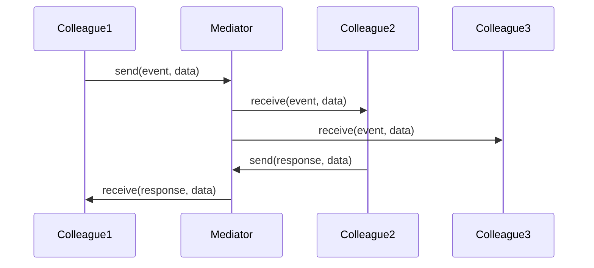

# Mediator Pattern

## What is the Pattern?

The Mediator pattern defines an object that encapsulates how a set of objects interact. It promotes loose coupling by keeping objects from referring to each other explicitly, and it lets you vary their interaction independently. The mediator acts as a central hub that coordinates communication between components.

## Key Participants

| Participant | Description |
|-------------|-------------|
| **Mediator** | Defines an interface for communicating with Colleague objects |
| **ConcreteMediator** | Implements cooperative behavior by coordinating Colleague objects |
| **Colleague** | Defines an interface for communicating with the Mediator |
| **ConcreteColleague** | Implements the Colleague interface and communicates with other colleagues through the Mediator |

## Key Characteristics

- **Centralized Control**: All communication flows through a single mediator
- **Loose Coupling**: Colleagues don't know about each other directly
- **Simplified Communication**: Complex interactions become manageable
- **Single Responsibility**: Mediator handles coordination logic
- **Extensible**: Easy to add new colleagues without changing existing ones
- **Event-Driven**: Often uses events or callbacks for communication

## How it Works

1. **Colleagues** register with the **Mediator**
2. **Colleagues** communicate by sending messages to the **Mediator**
3. **Mediator** routes messages to appropriate **Colleagues**
4. **Mediator** can add logic, validation, or transformation to messages
5. **Colleagues** remain decoupled from each other

## Structure

```
Colleague1 → Mediator → Colleague2
Colleague3 ↗         ↖ Colleague4
```

## Benefits

✅ **Reduces coupling** - Colleagues don't need direct references to each other  
✅ **Centralizes control** - All interaction logic is in one place  
✅ **Simplifies maintenance** - Changes to interaction logic only affect the mediator  
✅ **Promotes reusability** - Colleagues can be reused in different contexts  
✅ **Eases testing** - Can test interactions by mocking the mediator  
✅ **Supports event-driven architecture** - Natural fit for event-based systems  

## Drawbacks

❌ **Mediator can become complex** - Single point of coordination can grow unwieldy  
❌ **Potential performance bottleneck** - All communication goes through one object  
❌ **Tight coupling to mediator** - Colleagues become dependent on mediator interface  
❌ **Debugging complexity** - Hard to trace communication flow through mediator  
❌ **God object risk** - Mediator can become a monolithic controller  

## When to Use / Avoid

**Use when:**
- A set of objects communicate in complex ways
- You want to avoid tight coupling between objects
- You need to centralize control over object interactions
- You want to make object interactions more manageable
- You're building event-driven or message-passing systems
- You need to add new interaction patterns without changing existing objects

**Avoid when:**
- Object interactions are simple and few
- Performance is critical and mediator would be a bottleneck
- You need direct object-to-object communication for efficiency
- The mediator would become overly complex
- You're building a simple system with minimal object interaction

## Real-World Examples

- **Air Traffic Control**: Coordinates communication between aircraft
- **Chat Applications**: Manages message routing between users
- **GUI Frameworks**: Coordinates UI component interactions
- **Microservices Communication**: Centralized service coordination
- **Game Engines**: Manages interactions between game objects

## Common Implementation Variations

### 1. Basic Mediator
```typescript
interface Mediator {
  notify(sender: Colleague, event: string, data?: any): void;
}

interface Colleague {
  setMediator(mediator: Mediator): void;
  send(event: string, data?: any): void;
  receive(event: string, data?: any): void;
}

class ConcreteMediator implements Mediator {
  private colleagues: Colleague[] = [];
  
  addColleague(colleague: Colleague): void {
    this.colleagues.push(colleague);
    colleague.setMediator(this);
  }
  
  notify(sender: Colleague, event: string, data?: any): void {
    this.colleagues.forEach(colleague => {
      if (colleague !== sender) {
        colleague.receive(event, data);
      }
    });
  }
}
```

### 2. Event-Based Mediator
```typescript
class EventMediator {
  private events: Map<string, Function[]> = new Map();
  
  subscribe(event: string, callback: Function): void {
    if (!this.events.has(event)) {
      this.events.set(event, []);
    }
    this.events.get(event)!.push(callback);
  }
  
  publish(event: string, data?: any): void {
    const callbacks = this.events.get(event) || [];
    callbacks.forEach(callback => callback(data));
  }
  
  unsubscribe(event: string, callback: Function): void {
    const callbacks = this.events.get(event) || [];
    const index = callbacks.indexOf(callback);
    if (index > -1) {
      callbacks.splice(index, 1);
    }
  }
}
```

### 3. State-Aware Mediator
```typescript
class StateMediator {
  private state: Map<string, any> = new Map();
  private observers: Map<string, Function[]> = new Map();
  
  setState(key: string, value: any): void {
    this.state.set(key, value);
    this.notifyObservers(key, value);
  }
  
  getState(key: string): any {
    return this.state.get(key);
  }
  
  observe(key: string, callback: Function): void {
    if (!this.observers.has(key)) {
      this.observers.set(key, []);
    }
    this.observers.get(key)!.push(callback);
  }
  
  private notifyObservers(key: string, value: any): void {
    const callbacks = this.observers.get(key) || [];
    callbacks.forEach(callback => callback(value));
  }
}
```

### 4. Command-Based Mediator
```typescript
interface Command {
  execute(): void;
  undo(): void;
}

class CommandMediator {
  private commands: Command[] = [];
  private currentIndex: number = -1;
  
  execute(command: Command): void {
    // Remove any commands after current position (for redo)
    this.commands = this.commands.slice(0, this.currentIndex + 1);
    
    command.execute();
    this.commands.push(command);
    this.currentIndex++;
  }
  
  undo(): void {
    if (this.currentIndex >= 0) {
      this.commands[this.currentIndex].undo();
      this.currentIndex--;
    }
  }
  
  redo(): void {
    if (this.currentIndex < this.commands.length - 1) {
      this.currentIndex++;
      this.commands[this.currentIndex].execute();
    }
  }
}
```

## Related Patterns

- **Observer**: Mediator can use Observer pattern for event notification
- **Facade**: Both simplify complex interactions, but Mediator coordinates peers
- **Command**: Mediator can use Command pattern for action encapsulation
- **Chain of Responsibility**: Mediator can implement chain-like routing logic
- **Event Bus**: Mediator can be implemented as an event bus

## Implementation Highlights

- **Registration Mechanism**: Colleagues register with mediator
- **Message Routing**: Mediator determines message recipients
- **Event Handling**: Supports various event types and data
- **State Management**: Can maintain shared state between colleagues
- **Error Handling**: Centralized error handling for interactions

## Sequence Diagram



## Pitfalls & Anti-Patterns

- **God Object**: Mediator becomes too large and complex
- **Tight Coupling**: Colleagues become too dependent on mediator
- **Performance Issues**: Mediator becomes a bottleneck
- **Over-Engineering**: Using mediator for simple interactions
- **Event Explosion**: Too many events making system hard to understand

## Testing Tips

- Mock the mediator to test colleague behavior in isolation
- Test mediator routing logic independently
- Verify event propagation and data transformation
- Test error handling and edge cases
- Ensure proper cleanup of event subscriptions

## Performance Notes

- Mediator can become a performance bottleneck in high-frequency systems
- Consider async processing for non-critical communications
- Use event pooling to reduce object creation overhead
- Implement lazy initialization for rarely-used features
- Consider caching frequently accessed data in mediator 