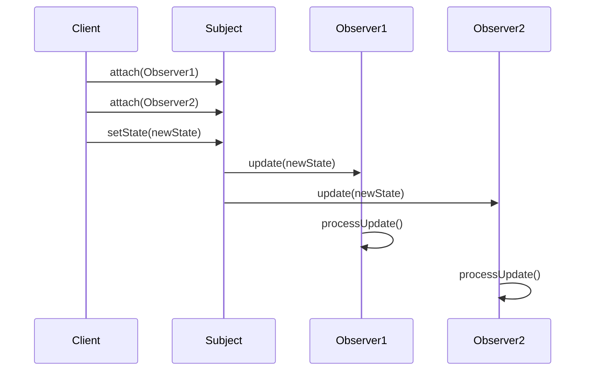

# Observer Pattern

## What is the Pattern?

The Observer pattern defines a one-to-many dependency between objects so that when one object (the subject) changes state, all its dependents (observers) are notified and updated automatically. It enables loose coupling between the subject and its observers, allowing for dynamic subscription and unsubscription.

## Key Participants

| Participant | Description |
|-------------|-------------|
| **Subject** | Maintains a list of observers and notifies them of state changes |
| **Observer** | Defines an interface for objects that should be notified of changes |
| **ConcreteSubject** | Stores state of interest to ConcreteObserver objects and sends notifications |
| **ConcreteObserver** | Implements the Observer interface and maintains a reference to a ConcreteSubject |

## Key Characteristics

- **Loose Coupling**: Subject and observers are loosely coupled - they only know about the notification interface
- **One-to-Many Relationship**: One subject can have multiple observers
- **Dynamic Subscription**: Observers can subscribe and unsubscribe at runtime
- **Push/Pull Models**: Can implement push (subject sends data) or pull (observer requests data) notification models
- **Event-Driven**: Enables event-driven programming and reactive systems

## How it Works

1. **Subject Registration**: Observers register themselves with the subject
2. **State Change**: Subject's state changes through some operation
3. **Notification**: Subject automatically notifies all registered observers
4. **Update**: Each observer receives the notification and updates accordingly
5. **Optional Unsubscription**: Observers can unsubscribe when no longer interested

## Structure

```
Subject                    Observer
+----------------+        +----------------+
| -observers     |        | +update()      |
| +attach()      |<------>|                |
| +detach()      |        +----------------+
| +notify()      |                 ^
+----------------+                 |
         ^                         |
         |                         |
ConcreteSubject            ConcreteObserver
+----------------+        +----------------+
| -state         |        | -subject       |
| +getState()    |        | +update()      |
| +setState()    |        | +updateState() |
+----------------+        +----------------+
```

## Benefits

✅ **Loose Coupling**: Subject and observers are independent of each other  
✅ **Extensibility**: Easy to add new observers without modifying existing code  
✅ **Reusability**: Observer interface can be reused across different subjects  
✅ **Event Handling**: Natural fit for event-driven architectures  
✅ **Real-time Updates**: Enables real-time data synchronization  
✅ **Separation of Concerns**: Clear separation between data and presentation  

## Drawbacks

❌ **Memory Leaks**: Observers must be properly unsubscribed to avoid memory leaks  
❌ **Unexpected Updates**: Observers may receive notifications they don't expect  
❌ **Update Order**: No guarantee of notification order across observers  
❌ **Performance**: Can cause performance issues with many observers  
❌ **Debugging Complexity**: Hard to debug when many observers are involved  
❌ **Tight Coupling Risk**: Can lead to tight coupling if observers know too much about subjects  

## When to Use / Avoid

### Use When:
- An object needs to notify other objects without knowing who they are
- You need to implement event handling systems
- You want to implement publish-subscribe mechanisms
- You need to maintain consistency between related objects
- You're building reactive or event-driven applications

### Avoid When:
- The subject has very few or no observers
- The notification order is critical and must be guaranteed
- You need to avoid the overhead of maintaining observer lists
- The relationship between subject and observers is very simple
- You're dealing with high-frequency updates that could cause performance issues

## Real-World Examples

- **Stock Market Systems**: Stock prices notify traders and portfolio managers
- **User Interface Frameworks**: Model changes notify views to update
- **Logging Systems**: Application events notify various loggers
- **Social Media Feeds**: User posts notify followers
- **Game Engines**: Game state changes notify UI components and AI systems

## Common Implementation Variations

### 1. Push vs Pull Models
```typescript
// Push Model - Subject sends data to observers
interface Observer {
  update(data: any): void;
}

// Pull Model - Observer requests data from subject
interface Observer {
  update(subject: Subject): void;
}
```

### 2. Event-Based Observers
```typescript
interface EventObserver {
  onEvent(event: Event): void;
}

class EventSubject {
  private observers = new Map<string, EventObserver[]>();
  
  subscribe(eventType: string, observer: EventObserver): void {
    // Implementation
  }
}
```

### 3. Async Observers
```typescript
interface AsyncObserver {
  updateAsync(data: any): Promise<void>;
}

class AsyncSubject {
  async notifyAll(data: any): Promise<void> {
    const promises = this.observers.map(obs => obs.updateAsync(data));
    await Promise.all(promises);
  }
}
```

### 4. Observer with Filtering
```typescript
interface FilteredObserver {
  update(data: any): void;
  shouldReceive(data: any): boolean;
}

class FilteredSubject {
  notifyAll(data: any): void {
    this.observers
      .filter(obs => obs.shouldReceive(data))
      .forEach(obs => obs.update(data));
  }
}
```

## Related Patterns

- **Mediator**: Can use Observer to notify components about mediator events
- **Command**: Commands can use Observer to notify about execution status
- **State**: State changes can notify observers about state transitions
- **Chain of Responsibility**: Can combine with Observer for event propagation
- **Event Sourcing**: Observer pattern is fundamental to event sourcing architectures

## Implementation Highlights

- **Memory Management**: Always provide unsubscribe mechanisms
- **Thread Safety**: Consider thread safety for multi-threaded environments
- **Error Handling**: Handle observer exceptions to prevent cascading failures
- **Performance**: Use efficient data structures for observer management
- **Testing**: Mock observers for unit testing subjects

## Sequence Diagram



## Pitfalls & Anti-Patterns

- **Observer Explosion**: Too many observers can cause performance issues
- **Circular Dependencies**: Observers updating subjects can cause infinite loops
- **Memory Leaks**: Forgetting to unsubscribe observers
- **Tight Coupling**: Observers knowing too much about subject internals
- **Update Storms**: Cascading updates between multiple subjects and observers

## Testing Tips

- Use mock observers to verify notification behavior
- Test unsubscribe functionality to prevent memory leaks
- Verify observer order if it matters for your use case
- Test error handling when observers throw exceptions
- Use integration tests for complex observer interactions

## Performance Notes

- Observer lists should use efficient data structures (Set/Map)
- Consider batching notifications for high-frequency updates
- Use weak references for observers that might be garbage collected
- Profile memory usage with large numbers of observers
- Consider using event loops for async observer processing 