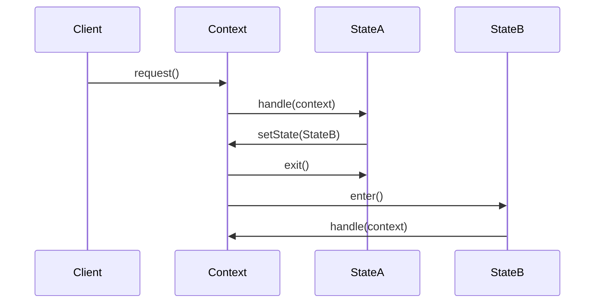

# State Pattern

## What is the Pattern?

The State pattern allows an object to alter its behavior when its internal state changes. The object will appear to change its class. It encapsulates state-specific behavior in separate classes and delegates state-dependent operations to the current state object, eliminating the need for large conditional statements.

## Key Participants

| Participant | Description |
|-------------|-------------|
| **Context** | Maintains a reference to a State object and delegates state-specific behavior to it |
| **State** | Defines an interface for encapsulating the behavior associated with a particular state |
| **ConcreteState** | Implements the behavior associated with a particular state of the Context |

## Key Characteristics

- **State Encapsulation**: Each state is encapsulated in its own class
- **Context Delegation**: Context delegates state-specific behavior to current state object
- **State Transitions**: States can transition to other states based on conditions
- **No Conditional Logic**: Eliminates complex conditional statements in Context
- **Single Responsibility**: Each state class has a single responsibility
- **Open/Closed Principle**: Easy to add new states without modifying existing code

## How it Works

1. **State Definition**: Define a State interface with methods for state-specific behavior
2. **Concrete States**: Implement concrete state classes for each possible state
3. **Context Setup**: Context maintains a reference to current state and delegates operations
4. **State Transitions**: States can transition to other states by updating Context's state reference
5. **Behavior Delegation**: Context delegates all state-dependent operations to current state

## Structure

```
Context                    State
+----------------+        +----------------+
| -state         |        | +handle()      |
| +request()     |<------>| +enter()       |
| +setState()    |        | +exit()        |
+----------------+        +----------------+
         ^                         ^
         |                         |
         |                         |
    ConcreteStateA         ConcreteStateB
+----------------+        +----------------+
| +handle()      |        | +handle()      |
| +enter()       |        | +enter()       |
| +exit()        |        | +exit()        |
+----------------+        +----------------+
```

## Benefits

✅ **Eliminates Conditional Logic**: No more complex if-else statements in Context  
✅ **Single Responsibility**: Each state class handles one state's behavior  
✅ **Easy State Addition**: New states can be added without modifying existing code  
✅ **State-Specific Behavior**: Each state can have completely different behavior  
✅ **Encapsulation**: State-specific data and behavior are encapsulated together  
✅ **Maintainability**: State logic is organized and easy to understand  
✅ **Testability**: Each state can be tested independently  

## Drawbacks

❌ **Increased Complexity**: More classes and objects in the system  
❌ **State Transition Logic**: Can become complex with many states and transitions  
❌ **Memory Overhead**: Each state object consumes memory  
❌ **Debugging Difficulty**: Hard to trace state transitions in complex systems  
❌ **Over-Engineering**: Can be overkill for simple state machines  
❌ **State Explosion**: Too many states can make the system hard to manage  

## When to Use / Avoid

### Use When:
- An object's behavior depends on its state and it must change its behavior at runtime
- You have complex conditional statements that depend on object state
- You need to represent state transitions explicitly
- You want to avoid large conditional statements in your code
- You're implementing state machines or workflow systems
- You need to add new states without modifying existing state logic

### Avoid When:
- The object has only a few states and simple state-dependent behavior
- State transitions are very simple and don't change often
- The overhead of additional classes outweighs the benefits
- You're dealing with simple boolean flags or enums
- The state logic is straightforward and unlikely to change

## Real-World Examples

- **Vending Machines**: Different states for idle, selecting, dispensing, out of stock
- **Game Characters**: States like idle, walking, running, jumping, attacking
- **Order Processing**: States like pending, confirmed, shipped, delivered, cancelled
- **Traffic Lights**: States like red, yellow, green with automatic transitions
- **Document Workflow**: States like draft, review, approved, published
- **ATM Machines**: States like idle, card inserted, PIN entered, transaction selection

## Common Implementation Variations

### 1. State with Entry/Exit Actions
```typescript
interface State {
  enter(context: Context): void;
  exit(context: Context): void;
  handle(context: Context): void;
}

class ConcreteState implements State {
  enter(context: Context): void {
    // Setup when entering this state
  }
  
  exit(context: Context): void {
    // Cleanup when leaving this state
  }
  
  handle(context: Context): void {
    // Handle state-specific behavior
  }
}
```

### 2. State with Parameters
```typescript
interface State {
  handle(context: Context, data?: any): void;
  canTransitionTo(newState: State): boolean;
}

class Context {
  private state: State;
  
  request(data?: any): void {
    this.state.handle(this, data);
  }
  
  setState(newState: State): void {
    if (this.state.canTransitionTo(newState)) {
      this.state.exit(this);
      this.state = newState;
      this.state.enter(this);
    }
  }
}
```

### 3. Hierarchical States
```typescript
abstract class State {
  protected parent?: State;
  
  setParent(parent: State): void {
    this.parent = parent;
  }
  
  handle(context: Context): void {
    // Handle in this state, delegate to parent if not handled
    if (!this.handleLocal(context) && this.parent) {
      this.parent.handle(context);
    }
  }
  
  protected abstract handleLocal(context: Context): boolean;
}
```

### 4. State with History
```typescript
class Context {
  private state: State;
  private stateHistory: State[] = [];
  
  setState(newState: State): void {
    this.stateHistory.push(this.state);
    this.state.exit(this);
    this.state = newState;
    this.state.enter(this);
  }
  
  revertToPreviousState(): void {
    if (this.stateHistory.length > 0) {
      this.state.exit(this);
      this.state = this.stateHistory.pop()!;
      this.state.enter(this);
    }
  }
}
```

## Related Patterns

- **Strategy**: Both encapsulate algorithms, but State changes behavior based on internal state
- **Command**: Commands can represent state transitions or actions
- **Memento**: Can be used to save and restore state snapshots
- **Observer**: Can notify observers about state changes
- **Chain of Responsibility**: Can be used to handle state transitions
- **Template Method**: Can define state transition algorithms

## Implementation Highlights

- **State Transitions**: Define clear rules for when and how states can transition
- **State Validation**: Validate state transitions to prevent invalid states
- **Entry/Exit Actions**: Use enter/exit methods for state setup and cleanup
- **State Data**: Consider what data belongs to the state vs. the context
- **Thread Safety**: Ensure state transitions are thread-safe in concurrent systems

## Sequence Diagram



## Pitfalls & Anti-Patterns

- **State Explosion**: Too many states making the system complex
- **Tight Coupling**: States knowing too much about other states
- **Circular Dependencies**: States creating circular references
- **State Leakage**: State-specific data leaking into context
- **Complex Transitions**: Overly complex state transition logic
- **God Context**: Context becoming too large and complex

## Testing Tips

- Test each state independently
- Test state transitions thoroughly
- Mock states for testing context behavior
- Test edge cases in state transitions
- Verify state invariants are maintained 