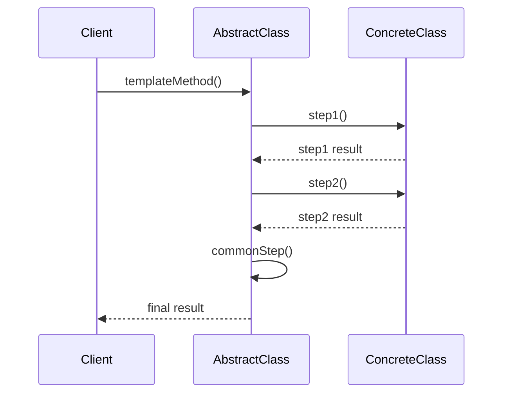

# Template Method Pattern

## What is the Pattern?

The Template Method pattern defines the skeleton of an algorithm in a method, deferring some steps to subclasses. It lets subclasses redefine certain steps of an algorithm without changing the algorithm's structure. The template method ensures that the algorithm's structure remains the same while allowing subclasses to provide their own implementations for specific steps.

## Key Participants

| Participant | Description |
|-------------|-------------|
| **AbstractClass** | Defines abstract primitive operations that concrete subclasses must implement |
| **ConcreteClass** | Implements the primitive operations to carry out subclass-specific steps of the algorithm |
| **Template Method** | Defines the skeleton of an algorithm, deferring some steps to subclasses |

## Key Characteristics

- **Algorithm Structure**: Defines the overall structure of an algorithm in a base class
- **Primitive Operations**: Declares abstract methods that subclasses must implement
- **Hook Methods**: Provides optional methods that subclasses can override
- **Invariant Steps**: Contains steps that are common to all subclasses
- **Variant Steps**: Contains steps that vary between subclasses
- **Final Template**: The template method is usually final to prevent overriding

## How it Works

1. **Template Definition**: Abstract class defines a template method containing the algorithm structure
2. **Primitive Operations**: Abstract methods declare operations that subclasses must implement
3. **Hook Methods**: Optional methods that subclasses can override for customization
4. **Concrete Implementation**: Subclasses implement the primitive operations
5. **Algorithm Execution**: Template method orchestrates the algorithm execution

## Structure

```
AbstractClass
+----------------+
| +templateMethod()|
| +primitiveOp1()  |<--abstract
| +primitiveOp2()  |<--abstract
| +hook()          |<--optional
| +concreteOp()    |<--common
+----------------+
         ^
         |
ConcreteClass
+----------------+
| +primitiveOp1()  |
| +primitiveOp2()  |
| +hook()          |<--optional override
+----------------+
```

## Benefits

✅ **Code Reuse**: Common algorithm structure is defined once in the base class  
✅ **Extensibility**: Easy to add new algorithm variants by creating new subclasses  
✅ **Consistency**: Ensures all subclasses follow the same algorithm structure  
✅ **Maintainability**: Changes to the algorithm structure only need to be made in one place  
✅ **Flexibility**: Subclasses can customize specific steps without changing the overall flow  
✅ **Inversion of Control**: Base class controls the algorithm flow, subclasses provide implementations  

## Drawbacks

❌ **Inheritance Coupling**: Subclasses are tightly coupled to the base class  
❌ **Rigid Structure**: The algorithm structure is fixed and cannot be easily modified  
❌ **Limited Flexibility**: Cannot easily change the order of steps or add new steps  
❌ **Complexity**: Can lead to deep inheritance hierarchies  
❌ **Testing Difficulty**: Template methods can be harder to test in isolation  
❌ **Violation of LSP**: Subclasses must follow the template structure exactly  

## When to Use / Avoid

### Use When:
- You have an algorithm with a fixed structure but variable steps
- You want to avoid code duplication in similar algorithms
- You need to ensure all subclasses follow the same algorithm structure
- You want to provide a framework that clients can extend
- You have multiple classes that share similar behavior patterns
- You want to control the algorithm flow from a base class

### Avoid When:
- The algorithm structure needs to be flexible or changeable
- You need to support multiple inheritance or composition
- The steps in the algorithm vary significantly between implementations
- You want to avoid tight coupling between base and derived classes
- The algorithm is simple and doesn't benefit from the template structure
- You need to change the order of steps dynamically

## Real-World Examples

- **Build Systems**: Different build processes (compile, test, package, deploy) with project-specific steps
- **Data Processing Pipelines**: ETL processes with different data sources and transformations
- **Game Engines**: Game loop with different game-specific update and render methods
- **Web Frameworks**: Request processing with different middleware and handlers
- **Report Generators**: Report creation with different data sources and formats
- **Database Operations**: CRUD operations with different validation and persistence logic

## Common Implementation Variations

### 1. Template Method with Hooks
```typescript
abstract class AbstractClass {
  templateMethod(): void {
    this.step1();
    this.step2();
    if (this.shouldDoStep3()) {
      this.step3();
    }
    this.step4();
  }
  
  abstract step1(): void;
  abstract step2(): void;
  step3(): void { /* default implementation */ }
  shouldDoStep3(): boolean { return true; } // hook method
  step4(): void { /* common implementation */ }
}
```

### 2. Template Method with Parameters
```typescript
abstract class AbstractClass {
  templateMethod(data: any): void {
    const processedData = this.preprocess(data);
    const result = this.process(processedData);
    this.postprocess(result);
  }
  
  abstract preprocess(data: any): any;
  abstract process(data: any): any;
  postprocess(result: any): void { /* common implementation */ }
}
```

### 3. Template Method with Multiple Variants
```typescript
abstract class AbstractClass {
  templateMethod(): void {
    this.setup();
    this.execute();
    this.cleanup();
  }
  
  setup(): void { /* common setup */ }
  abstract execute(): void;
  cleanup(): void { /* common cleanup */ }
  
  // Optional hooks
  beforeExecute(): void { }
  afterExecute(): void { }
}
```

### 4. Template Method with Strategy Integration
```typescript
abstract class AbstractClass {
  constructor(private strategy: Strategy) {}
  
  templateMethod(): void {
    this.step1();
    this.strategy.execute();
    this.step2();
  }
  
  abstract step1(): void;
  abstract step2(): void;
}
```

## Related Patterns

- **Strategy**: Template Method uses inheritance, Strategy uses composition
- **Factory Method**: Often implemented using Template Method
- **Builder**: Can use Template Method to define the build process
- **Chain of Responsibility**: Can use Template Method to define the chain structure
- **Command**: Template Method can define the command execution structure
- **Observer**: Template Method can define the notification process

## Implementation Highlights

- **Final Template**: Make the template method final to prevent overriding
- **Abstract Methods**: Use abstract methods for steps that must be implemented
- **Hook Methods**: Provide hook methods for optional customization
- **Default Implementations**: Provide sensible defaults for common operations
- **Documentation**: Clearly document the template method's contract
- **Testing**: Test each step independently and the overall flow

## Sequence Diagram



## Pitfalls & Anti-Patterns

- **Template Method Explosion**: Too many template methods in one class
- **Deep Inheritance**: Creating deep inheritance hierarchies
- **Rigid Structure**: Making the template too rigid to be useful
- **Hook Abuse**: Using too many hooks that make the flow unpredictable
- **Violation of LSP**: Subclasses that don't follow the template contract
- **Over-Engineering**: Using Template Method for simple algorithms

## Testing Tips

- Test each primitive operation independently
- Test the template method with different concrete implementations
- Mock abstract methods to test the template flow
- Test hook methods with different return values
- Verify that the algorithm structure is maintained
- Test edge cases and error conditions 