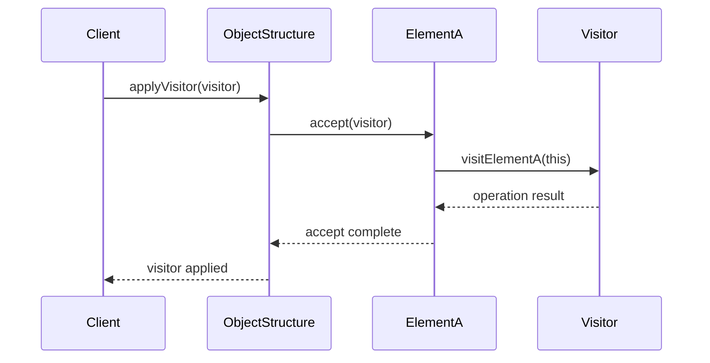

# Visitor Pattern

## What is the Pattern?

The Visitor pattern represents an operation to be performed on the elements of an object structure. It lets you define a new operation without changing the classes of the elements on which it operates. The Visitor pattern separates the algorithm from the object structure on which it operates, allowing you to add new operations without modifying existing classes.

## Key Participants

| Participant | Description |
|-------------|-------------|
| **Visitor** | Declares a visit operation for each class of ConcreteElement |
| **ConcreteVisitor** | Implements each operation declared by Visitor |
| **Element** | Defines an accept operation that takes a visitor as an argument |
| **ConcreteElement** | Implements the accept operation |
| **ObjectStructure** | Can enumerate its elements and provide a high-level interface |

## Key Characteristics

- **Double Dispatch**: Uses two method calls to determine the operation to execute
- **Separation of Concerns**: Separates algorithms from the objects they operate on
- **Open/Closed Principle**: Open for extension (new visitors), closed for modification
- **Type Safety**: Provides compile-time type checking for visitor operations
- **Extensibility**: Easy to add new operations without changing existing classes
- **Encapsulation**: Visitor encapsulates operations that would otherwise be scattered

## How it Works

1. **Visitor Interface**: Defines visit methods for each element type
2. **Element Interface**: Defines accept method that takes a visitor
3. **Concrete Visitors**: Implement specific operations for each element type
4. **Concrete Elements**: Implement accept method to call visitor's visit method
5. **Object Structure**: Manages collection of elements and applies visitors

## Structure

```
Visitor
+----------------+
| +visitA(ElementA)|
| +visitB(ElementB)|
+----------------+
         ^
         |
ConcreteVisitor
+----------------+
| +visitA(ElementA)|
| +visitB(ElementB)|
+----------------+

Element
+----------------+
| +accept(Visitor) |
+----------------+
         ^
         |
ElementA/ElementB
+----------------+
| +accept(Visitor) |
| +operationA()    |
| +operationB()    |
+----------------+
```

## Benefits

✅ **Open/Closed Principle**: Easy to add new operations without modifying existing classes  
✅ **Single Responsibility**: Each visitor class handles one specific operation  
✅ **Extensibility**: New operations can be added by creating new visitor classes  
✅ **Encapsulation**: Related operations are grouped together in visitor classes  
✅ **Type Safety**: Compile-time checking ensures correct visitor-element combinations  
✅ **Separation of Concerns**: Algorithms are separated from object structure  
✅ **Maintainability**: Changes to operations don't affect element classes  

## Drawbacks

❌ **Complexity**: Can make the code more complex and harder to understand  
❌ **Tight Coupling**: Visitors need to know about all concrete element types  
❌ **Breaking Encapsulation**: Visitors may need access to internal element state  
❌ **Performance Overhead**: Double dispatch adds method call overhead  
❌ **Difficult Refactoring**: Adding new element types requires updating all visitors  
❌ **Limited Flexibility**: Visitors can't easily access private element members  
❌ **Design Complexity**: Requires careful design to avoid circular dependencies  

## When to Use / Avoid

### Use When:
- You have a complex object structure with many different operations
- You want to separate algorithms from the objects they operate on
- You need to add new operations frequently without changing existing classes
- You have operations that don't belong in the element classes
- You want to perform operations across a heterogeneous object structure
- You need to avoid polluting element classes with operation-specific code

### Avoid When:
- The object structure is simple and rarely changes
- Operations are tightly coupled to element implementation details
- You need to access private members of elements frequently
- Performance is critical and method call overhead is a concern
- The object structure changes frequently (adding new element types)
- Operations are simple and don't benefit from separation

## Real-World Examples

- **Document Processing**: Different operations on document elements (export, print, validate)
- **Compiler Design**: AST visitors for code analysis, optimization, and code generation
- **Graphics Systems**: Operations on graphic objects (render, serialize, transform)
- **File Systems**: Operations on file system objects (backup, search, permissions)
- **Game Engines**: Operations on game objects (update, render, serialize)
- **Configuration Systems**: Operations on configuration objects (validate, export, migrate)

## Common Implementation Variations

### 1. Basic Visitor Pattern
```typescript
interface Visitor {
  visitElementA(element: ElementA): void;
  visitElementB(element: ElementB): void;
}

interface Element {
  accept(visitor: Visitor): void;
}

class ConcreteVisitor implements Visitor {
  visitElementA(element: ElementA): void {
    // Operation on ElementA
  }
  
  visitElementB(element: ElementB): void {
    // Operation on ElementB
  }
}
```

### 2. Visitor with Return Values
```typescript
interface Visitor<T> {
  visitElementA(element: ElementA): T;
  visitElementB(element: ElementB): T;
}

interface Element {
  accept<T>(visitor: Visitor<T>): T;
}
```

### 3. Visitor with State
```typescript
class StatefulVisitor implements Visitor {
  private state: any = {};
  
  visitElementA(element: ElementA): void {
    // Use and update state
    this.state.count = (this.state.count || 0) + 1;
  }
  
  visitElementB(element: ElementB): void {
    // Use and update state
    this.state.total += element.getValue();
  }
  
  getResult(): any {
    return this.state;
  }
}
```

### 4. Composite with Visitor
```typescript
interface Component {
  accept(visitor: Visitor): void;
}

class Composite implements Component {
  private children: Component[] = [];
  
  accept(visitor: Visitor): void {
    visitor.visitComposite(this);
    this.children.forEach(child => child.accept(visitor));
  }
}

class Leaf implements Component {
  accept(visitor: Visitor): void {
    visitor.visitLeaf(this);
  }
}
```

## Related Patterns

- **Composite**: Often used together with Visitor to operate on complex object structures
- **Strategy**: Visitor can be seen as a strategy for operations on object structures
- **Command**: Visitor encapsulates operations similar to Command pattern
- **Interpreter**: AST visitors are commonly used in interpreter implementations
- **Iterator**: Visitor can traverse object structures similar to Iterator
- **Template Method**: Visitor operations can use Template Method for common algorithms

## Implementation Highlights

- **Double Dispatch**: Use accept() method in elements to call appropriate visit() method
- **Type Safety**: Ensure visitor interface covers all concrete element types
- **State Management**: Consider how visitors manage state across multiple elements
- **Performance**: Be aware of method call overhead in performance-critical scenarios
- **Encapsulation**: Design visitor interfaces to minimize breaking encapsulation
- **Extensibility**: Plan for future element types when designing visitor interfaces

## Sequence Diagram



## Pitfalls & Anti-Patterns

- **Visitor Explosion**: Too many visitor classes for simple operations
- **Breaking Encapsulation**: Visitors accessing private element members
- **Tight Coupling**: Visitors knowing too much about element internals
- **Performance Issues**: Using visitors for simple operations that don't need separation
- **Complexity Overhead**: Using visitors when simpler patterns would suffice
- **Maintenance Burden**: Not updating all visitors when adding new element types

## Testing Tips

- Test each visitor independently with different element types
- Mock elements to test visitor behavior in isolation
- Test visitor state management across multiple elements
- Verify visitor operations work correctly with composite structures
- Test edge cases with empty object structures
- Ensure visitors handle element type changes gracefully 