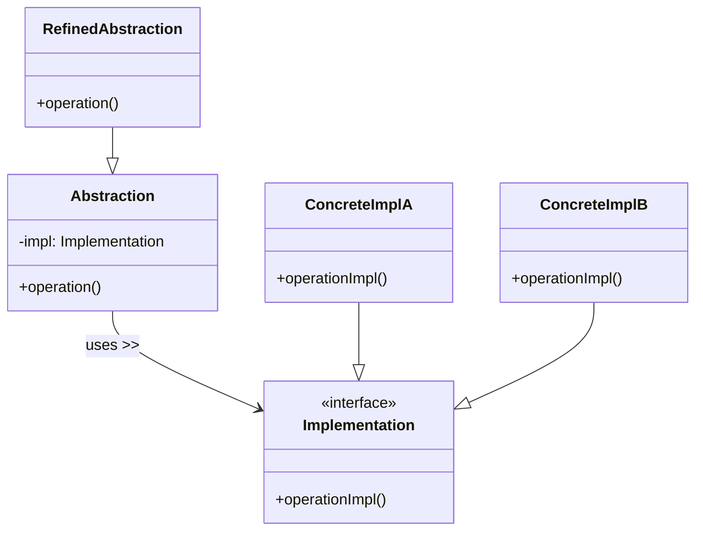

# Bridge Pattern

## What is the Bridge Pattern?

The Bridge pattern is a structural design pattern that decouples an abstraction from its implementation so the two can vary independently.  In other words, it splits a large class (or a set of closely-related classes) into two separate hierarchies—**Abstraction** and **Implementation**—which can be developed, extended, and composed independently.

> **Analogy:** A TV remote (abstraction) can work with any brand of TV (implementation) as long as they share a common communication protocol.

## Key Participants

| Role            | Responsibility |
|-----------------|----------------|
| **Abstraction** | Defines the high-level control interface and maintains a reference to an implementation object. |
| **RefinedAbstraction** | Extends the Abstraction interface for specific variants. |
| **Implementation** | Defines the low-level interface (often platform-specific).  Doesn't have to mirror Abstraction exactly. |
| **ConcreteImplementation** | Concrete classes implementing the Implementation interface. |



## Key Characteristics

1. **Decoupling**: Abstraction and implementation hierarchies are independent
2. **Run-time Flexibility**: Switch implementations without changing abstraction code
3. **Open for Extension**: Add new abstractions _or_ implementations without touching the other side
4. **Reduced Cartesian Explosion**: Avoids multiplying classes for every abstraction × platform combo

## How it Works

The pattern splits responsibilities into two interfaces:

- **Abstraction** – high-level operations that the client calls (e.g. `Message.send()`)
- **Implementation** – platform-specific low-level operations (e.g. `Channel.sendMessage()`)

Concrete abstractions delegate work to an implementation object held in a field.

## Structure

```
┌───────────────┐        uses        ┌──────────────────────┐
│  Abstraction   │──────────────►│   Implementation    │
│ + operation()  │                │ + operationImpl()   │
└───────────────┘                └──────────────────────┘
        ▲                                  ▲
        │                                  │
┌────────────────┐               ┌────────────────────┐
│RefinedAbstrctn1│               │ConcreteImplA       │
└────────────────┘               └────────────────────┘
┌────────────────┐               ┌────────────────────┐
│RefinedAbstrctn2│               │ConcreteImplB       │
└────────────────┘               └────────────────────┘
```

## Benefits

✅ **Independence** – Abstraction & Implementation can evolve separately.
✅ **Switching Implementations at Runtime** – e.g., change rendering API from DirectX to Vulkan.
✅ **Reduced Class Explosion** – Avoid Cartesian product of abstractions × platforms.
✅ **Single Responsibility** – Split high-level logic from platform details.

## Drawbacks

❌ More classes and indirection.
❌ Abstraction & Implementation interfaces must stay in sync.

## When to Use

* UI toolkits that must render on multiple platforms (Win/Mac/Linux).
* Data persistence layers supporting multiple databases.
* Device drivers or renderers that might swap APIs at runtime.
* Any time you spot the "Cartesian product" smell in class hierarchy.

## Real-World Examples

- **Cross-Platform Rendering**: Graphics engines that switch renderer back-ends (OpenGL, DirectX, Vulkan)
- **Storage SDKs**: Cloud-agnostic file APIs (AWS S3, Azure Blob, GCP Storage) – see `bridge:storage` demo
- **Messaging Gateways**: Alerts/Reports sent through Email, SMS, Slack – see `bridge:messaging`
- **Document Exporters**: Shapes drawn to PDF, SVG, Canvas – see `bridge:shapes`
- **Operating-System Abstractions**: System clipboard implementations for Win/Mac/Linux

## Common Implementation Variations

1. **Parameterized Bridge**
```typescript
// Switch implementation at construction time
const alert = new AlertMessage(new SmsChannel());
```
2. **Factory-Created Bridge**
```typescript
// Abstraction receives implementation via DI / Abstract Factory
const channel = ChannelFactory.for(config.platform);
return new ReportMessage(channel);
```
3. **Runtime Swappable Implementation**
```typescript
message.setChannel(new SlackChannel());
```
4. **Hierarchical Bridges**
```typescript
// Abstraction hierarchy gets another layer (e.g. SecureMessage extends Message)
```

## Related Patterns

* **Adapter** – Makes two existing interfaces work together; Bridge separates abstraction from implementation before they diverge.
* **Abstract Factory** – Creates families of related objects. Bridge can combine with Abstract Factory to create implementation objects.
* **Strategy** – Both allow swapping behaviour, but Strategy focuses on algorithm substitution while Bridge focuses on decoupling structure.
