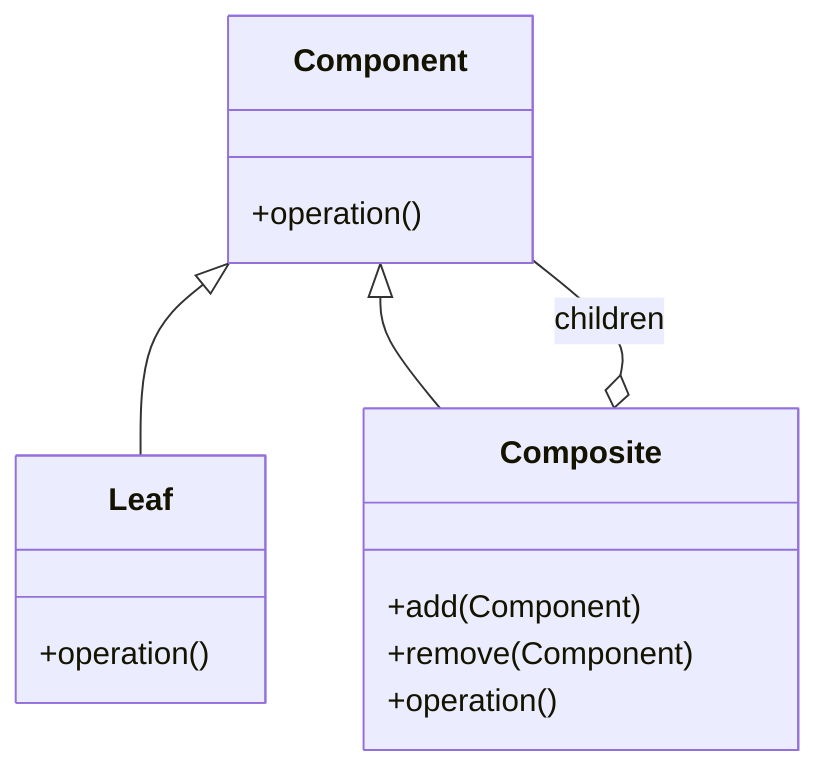

# Composite Pattern

## What is the Pattern?

The Composite pattern is a structural design pattern that lets you treat **individual objects** and **compositions of objects** uniformly.  It represents part–whole hierarchies so that clients can work with a single object or an entire tree via the same interface.

> **Analogy**: A file-system explorer where `File` and `Folder` both expose `getSize()` and `render()` – you can ask a single file or an entire folder tree for its size.

## Key Participants

| Role | Responsibility |
|------|----------------|
| **Component** | Declares the common interface (`operation`) for both simple and complex objects |
| **Leaf** | A basic element that has no children; implements component operations directly |
| **Composite** | A container that stores child components and implements operations by delegating to them |
| **Client** | Works with components via the uniform interface and doesn't care if it's a leaf or composite |



## Key Characteristics

1. **Tree Structure** – Represents part–whole hierarchies.
2. **Uniformity** – Client code treats individual and composed objects the same.
3. **Recursive Behaviour** – Composite operations often implemented via recursion over children.
4. **Extensibility** – Easy to add new leaf types without changing existing code.

## How it Works

1. Define a `Component` interface with operations (`add`, `remove`, `getSize`, `render`, etc.).
2. Implement `Leaf` objects that have no children.
3. Implement `Composite` objects that hold a collection of `Component`s.
4. Client stores references only to `Component` and treats leaves & composites uniformly.

## Structure (ASCII)
```
Client
  | uses
  v
Component (interface)
 ├── Leaf (no children)
 └── Composite (has list<Component>)
         ├── Leaf
         └── Composite
```

## Benefits

✅ Simplifies client code – no type checks for leaf vs composite.
✅ Facilitates recursive algorithms on object trees.
✅ New leaf/composite classes can be introduced without breaking clients.

## Drawbacks

❌ Can make the design overly general – hard to restrict which components can be children.
❌ May lead to over-design if hierarchy is simple.

## When to Use / Avoid

**Use when:**
* You need to represent a tree structure of objects.
* Clients should ignore the difference between individual and composed objects.
* Recursive traversal or aggregation operations are common (size, render, export, etc.).

**Avoid when:**
* Objects have vastly different interfaces – forcing them into a common interface causes leaky abstractions.
* The tree is fixed and shallow – simpler data structures suffice.

## Real-World Examples

- **File Systems** – Files & directories (demo: `composite:filesystem`).
- **UI Widgets** – Buttons, panels, windows where containers hold child widgets.
- **Graphic Scenes** – Shapes composed into groups for transformations.
- **Org Charts** – Employees & departments.
- **Menu Structures** – Menu items & sub-menus in apps.

## Common Implementation Variations

1. **Safe Composite** – `Leaf` doesn't expose `add/remove`; only `Composite` does.
2. **Transparent Composite** – `Component` declares all methods; simpler for client but leaves may implement meaningless operations.
3. **Fluent Composite** – `add()` returns `this` for chaining.
4. **Composite with Visitor** – Perform operations via Visitor to separate algorithms.

## Related Patterns

* **Decorator** – Also uses recursive composition but adds behaviour rather than part–whole.
* **Flyweight** – Shares leaf objects to reduce memory in large trees.
* **Iterator** – Can be used to traverse composite structures.
* **Visitor** – Adds new operations to all components without modifying them. 