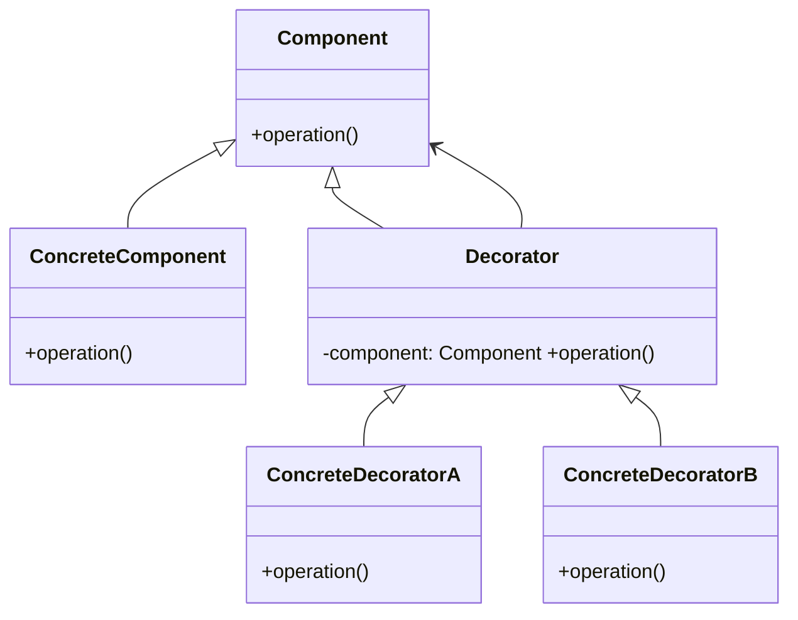

# Decorator Pattern

## What is the Pattern?

The Decorator pattern is a structural design pattern that lets you **attach additional responsibilities** to an object dynamically.  Decorators provide a flexible alternative to subclassing for extending functionality.

> Analogy: Putting different layers of wrapping paper around a gift—each layer adds something (a message, ribbons) without changing the gift inside.

## Key Participants

| Role | Responsibility |
|------|----------------|
| **Component** | Defines the common interface for objects that can have responsibilities added |
| **ConcreteComponent** | The original object to which new behaviour can be added |
| **Decorator (abstract)** | Wraps a component and implements the same interface, delegating calls |
| **ConcreteDecorator** | Adds responsibilities before/after delegating to the wrapped component |



## Key Characteristics

1. **Open/Closed** – Add behaviour without modifying existing code.
2. **Runtime Composition** – Stack decorators in any order at runtime.
3. **Single Responsibility** – Each decorator adds a single concern.
4. **Transparency** – Decorators share the same interface as the component.

## How it Works

Each decorator keeps a reference to a `Component`.  When `operation()` is called, a decorator can execute extra behaviour **before or after** delegating to the wrapped object.  Because decorators have the same interface, they are interchangeable and can be stacked.

## Structure
```
Client -> DecoratorB -> DecoratorA -> ConcreteComponent
```

## Benefits

✅ Add features without subclass explosion.
✅ Combine behaviours at runtime.
✅ Adhere to SOLID (Open/Closed, Single Responsibility).

## Drawbacks

❌ Many small classes.
❌ Order-sensitive—stacking wrong order can break logic.
❌ Harder to debug due to deep call stacks.

## When to Use / Avoid

Use when:
* You need many independent, combinable behaviours.
* Extending via inheritance would lead to class explosion.

Avoid when:
* Behaviour must be added uniformly to all instances (use subclassing or aspect approach).

## Real-World Examples

- **Express middleware pipeline** – Request handler wrapped by logging, auth, etc.
- **Java I/O streams** – `BufferedInputStream` decorates `FileInputStream`.
- **React HOCs** – Higher-order components add props/logic.
- **Logger formatters** – Timestamp, level, JSON wrappers.

## Common Implementation Variations

1. **Recursive Middleware** – Decorators arranged as chain-of-responsibility.
2. **Fluent Builder for Stacking** – Helper that chains `withX()` methods to build decorator stack.

## Related Patterns

* **Composite** – Both rely on recursive composition; Composite is part–whole, Decorator adds behaviour.
* **Proxy** – Same structure but intent differs (control access vs add behaviour). 