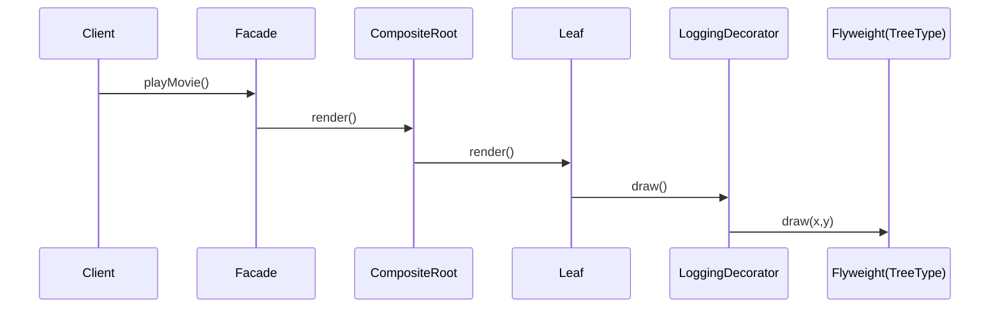

# Untangling Structural Patterns: Facade vs Composite vs Decorator vs Flyweight

> *A practitioner's guide to picking the right wrapper, tree, layer, or cache.*

## Executive Summary

Four structural patterns can look alike at first glance, yet each solves a **very specific everyday problem**:

| If you… | Then use… |
|---------|-----------|
| Are drowning in boiler-plate calls just to "get something done" | **Facade** – wrap the mess behind one friendly method |
| Need to treat a single item the same as a folder of items | **Composite** – build a tree whose leaves and branches share one interface |
| Want to bolt on logging / caching / auth **without** touching original code | **Decorator** – nest wrappers around the object |
| Are running out of RAM because millions of objects duplicate the same data | **Flyweight** – pull the shared bits into a cache |

Remember: the right pattern is the one that removes today's pain, not tomorrow's speculation.

---
## 1. Quick Reference Table

| Pattern | "In one sentence" | Look for… | Demo |
|---------|------------------|-----------|------|
| **Facade** | "Give me one high-level call and handle the ugly details for me." | Lots of setup steps for a simple business action. | `npm run facade:home` |
| **Composite** | "Treat boxes and things inside the boxes the same." | Recursive tree structures: menus, files, UI widgets. | `npm run composite:filesystem` |
| **Decorator** | "Add extra behaviour by plugging in LEGO® bricks, not by subclassing." | Logging, compression, retry logic that should be optional. | `npm run decorator:http` |
| **Flyweight** | "Share read-only data so each object keeps only what is unique." | Huge grids/maps with repeated textures, icons, or styles. | `npm run flyweight:forest` |

---
## 2. OO Perspective

### 2.1 Class Diagrams

```mermaid
classDiagram
class Facade {
  +op()
}
Facade --> "uses" SubsystemA
Facade --> SubsystemB

class Component <|-- Leaf
class Component <|-- Composite
Composite --> "*" Component : children

class ComponentDecorator {
  -next: Component
  +op()
}
ComponentDecorator <|-- LoggingDecorator
ComponentDecorator <|-- AuthDecorator

class FlyweightFactory --> Flyweight
class Context {
  -extrinsic
  -shared: Flyweight
}
```

### 2.2 Relationship Strength

* **Facade → Subsystem:** dependency *for convenience*, not ownership.
* **Composite → Child:** ownership; lifespan is bound to parent.
* **Decorator → Wrapped:** delegation; both share lifetime but are replaceable.
* **Flyweight → Context:** reference sharing; factory controls lifecycle.

---
## 3. Functional Perspective

In FP we cannot mutate wrapped objects. Still, each intent maps nicely:

| OO Pattern | FP Analogue | Repo Example |
|------------|------------|--------------|
| Facade | *Module* exposing high-level functions | `Function Patterns/index.ts` top-level re-exports |
| Composite | *Recursive ADT* (e.g. `type Tree = Leaf | Node<Tree[]>`) | `F5 - Observer Pattern` (listeners list) |
| Decorator | *Function composition* (`flow`, `pipe`) | `f4:decorator:middleware` |
| Flyweight | *Memoised pure function* returning shared constant | `F3 - Factory Pattern` caching HTTP clients |

---
## 4. Real-World Scenarios & Code

### 4.1 Simplifying a Video Pipeline (Facade)

```ts
// See full demo via npm run facade:home
homeTheater.watchMovie("Interstellar");
```

### 4.2 Rendering a Menu (Composite)

```ts
const fileMenu = new Menu('File');
fileMenu.add(new MenuItem('Open'));
fileMenu.add(new MenuItem('Save'));
fileMenu.render(); // renders children recursively
```

### 4.3 Adding Caching & Logging (Decorator)

```ts
// npm run decorator:http
const handler = new CacheDecorator(new LoggingDecorator(baseHandler));
await handler.handle(req);
```

### 4.4 Billion-Leaf Forest (Flyweight)

```ts
// npm run flyweight:forest
forest.plant(x, y, 'Oak', 'green', 'oak-texture');
```

---
## 5. Combining the Patterns

It's legal—often powerful—to mix them:

* A **Facade** can return a **Composite** root to advanced callers.
* Leaves of that composite may be wrapped with **Decorators** for logging.
* Those leaves can share **Flyweights** for textures to save RAM.



---
## 6. Best Practices vs. Pitfalls

| ✅ Do | ❌ Avoid |
|-------|---------|
| Keep a façade *thin*; push intelligence down. | God-Facade that re-implements subsystem logic. |
| Ensure composite `leaf` and `composite` behave identically from outside. | Special-casing leaf nodes in client code. |
| Give each decorator **one** responsibility. | Deep mandatory decorator stacks impossible to debug. |
| Keep flyweights **immutable** and identity-independent. | Mixing mutable state into shared flyweights. |

---
## 7. Performance Notes

Pattern | Cost | Optimisation Tip
--------|------|----------------
Decorator | More objects & indirection | Use shallow wrappers; compose at boot not per request.
Flyweight | Hash-map lookup | Key the cache with simple strings; pre-warm if possible.
Composite | Recursion depth | Flatten traversal with iterative queue for very deep trees.
Facade | Negligible | Keep orchestration code minimal to avoid new bottlenecks.

---
## Further Reading

* *Design Patterns: Elements of Reusable OO Software* – GoF, 1994.  
* [Refactoring.Guru Facade vs Composite vs Decorator](https://refactoring.guru/design-patterns)  
* *Effective Java (3rd ed.)* – see Item 45 for Flyweight in enums.

---
## Key Takeaways

1. **Intent first.** Choose the pattern that directly addresses your pain.  
2. **Patterns compose.** Don't hesitate to layer them when each adds clear value.  
3. **Keep them honest.** A pattern misapplied becomes accidental complexity. 